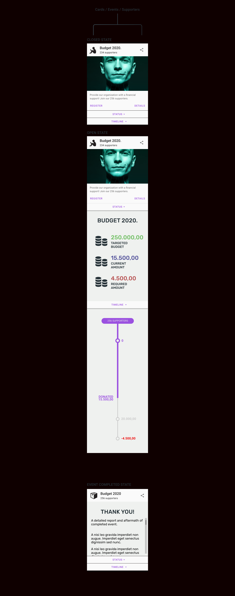
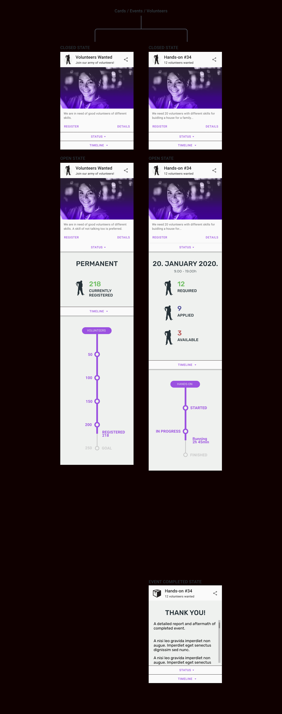
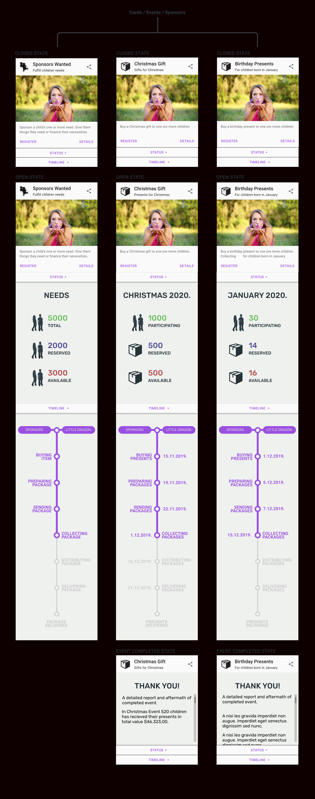
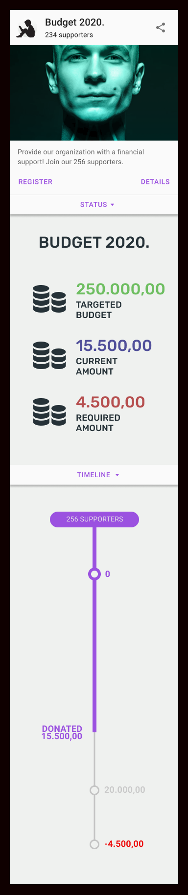
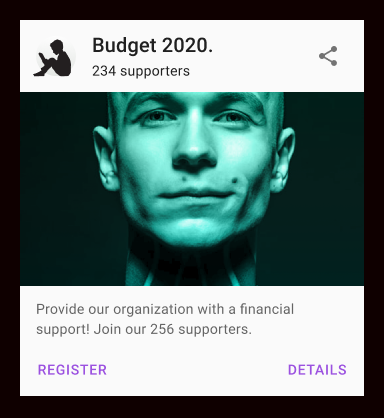
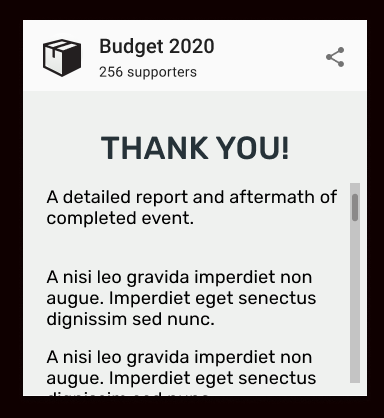
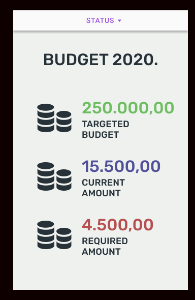

# 5.2. Events System

Our organization mobilizes people via various events.

* to obtain a financing for its activities - it organizes **Supporter events**
* to recruit a manpower it needs - it organizes **Volunteer events**
* to fulfill the children needs - it organizes **Sponsor events**.

Events are organized in different groups/types depending on purpose.

> Events by type

| Event | Supporters | Volunteers | Sponsors |
| :--- | :--- | :--- | :--- |
| _Budget 2020_ | Yes |  |  |
| _Volunteers Wanted_ |  | Yes |  |
| _Hands-on \#34_ |  | Yes |  |
| _Hands-on \#35_ |  | Yes |  |
| _Sponsors Wanted_ |  |  | Yes |
| _Christmas Gift_ |  |  | Yes |
| _Easter Gift_ |  |  | Yes |
| _Birthday Present January_ |  |  | Yes |
| _Back to School_ |  |  | Yes |
| _Vacation Summer_ |  |  | Yes |

Every event has a purpose, a goal. It targets **items**, **money** or **labor/manpower**. One event can have multiple targets.

> Events by purpose

| Event | Items | Money | Labor |  | Supporters | Volunteers | Sponsors |
| :--- | :--- | :--- | :--- | :--- | :--- | :--- | :--- |
| _Budget 2020_ |  | Yes |  |  | Yes |  |  |
| _Volunteers Wanted_ |  |  | Yes |  |  | Yes |  |
| _Hands-on \#34_ |  |  | Yes |  |  | Yes |  |
| _Hands-on \#35_ |  |  | Yes |  |  | Yes |  |
| _Sponsors Wanted_ | Yes | Yes |  |  |  |  | Yes |
| _Christmas Gift_ | Yes |  |  |  |  |  | Yes |
| _Easter Gift_ | Yes |  |  |  |  |  | Yes |
| _Birthday Presents for January_ | Yes |  |  |  |  |  | Yes |
| _Back to School_ | Yes |  |  |  |  |  | Yes |
| _Vacation Summer_ | Yes |  |  |  |  |  | Yes |

**Permanent events** are active all year. **One-time events** are events with limited duration, active from a few hours to several months.

> Events by frequency of activity

| Event | Permanent | One-time |  | Supporters | Volunteers | Sponsors |
| :--- | :--- | :--- | :--- | :--- | :--- | :--- |
| _Budget 2020_ | Yes |  |  | Yes |  |  |
| _Volunteers Wanted_ | Yes |  |  |  | Yes |  |
| _Hands-on \#34_ |  | Yes |  |  | Yes |  |
| _Hands-on \#35_ |  | Yes |  |  | Yes |  |
| _Sponsors Wanted_ | Yes |  |  |  |  | Yes |
| _Christmas Gift_ |  | Yes |  |  |  | Yes |
| _Easter Gift_ |  | Yes |  |  |  | Yes |
| _Birthday Presents for January_ |  | Yes |  |  |  | Yes |
| _Back to School_ |  | Yes |  |  |  | Yes |
| _Vacation Summer_ |  | Yes |  |  |  | Yes |

Sponsors events are organized so that sponsors can select to **fulfill one or more child's need**.

> Events by quantity of needs

| Event | Single-need | Multiple-need |  | Supporters | Volunteers | Sponsors |
| :--- | :--- | :--- | :--- | :--- | :--- | :--- |
| _Sponsors Wanted_ | Yes | Yes |  |  |  | Yes |
| _Christmas Gift_ | Yes |  |  |  |  | Yes |
| _Easter Gift_ | Yes |  |  |  |  | Yes |
| _Birthday Presents for January_ | Yes |  |  |  |  | Yes |
| Back to School | Yes |  |  |  |  | Yes |
| Vacation Summer | Yes |  |  |  |  | Yes |

Events can involve a **money transaction**. It can be a **one-time payment** or a **reccuring payment** on monthly basis.

Via Budget event, supporters can make a one-time or recurring donation to our organization.

Via Sponsor event, sponsors can make a one-time or recurring donation against the need \(child\).

> Events by payment frequency

| Event | One-time | Recurring |  | Supporters | Volunteers | Sponsors |
| :--- | :--- | :--- | :--- | :--- | :--- | :--- |
| _Budget 2020_ | Yes | Yes |  | Yes |  |  |
| _Sponsors Wanted_ | Yes | Yes |  |  |  | Yes |

## 5.2.1. Event Types and Categories

Events are grouped under 3 categories and each category a specific set of event types.

Here are examples of event categories with corresponding types.

### Supporter Event Category

* **budget type**

  Enables supporter's subscription to the reccuring financial payments to our organization, for instance _Budget 2020_ event. Sponsor can also make a one-time donation.

> Image of Supporter events



### Volunteer Event Category

* **recruitment type**

  Enables the recruitment of volunteers with required set of skills. Individuals can register as volunteers.

* **single-task type**

  Enables the participation of volunteers in a **single hands-on task**, like _Building a House_ event, _Transporting Children_ event etc.

> Image of Volunteer events



### Sponsor Event Category

* **single-need type**

  Enables sponsor's subscription to a **single need**, like the _Christmas Gift_ event, a _Birthday Present January_ event or the _Easter Gift_ event. A sponsor fulfills a single need of a child.

* **multi-need type**

  Enables sponsor's subscription to **multiple needs**, like _Sponsors Wanted_ event. A sponsor fulfills one or more needs of a child.

> Image of Sponsor events



## 5.2.2. Event UI Component

An event component is represented as an accordion UI element and consists of **card body**, **status element** and **timeline element**.

> Image of an expanded accordion.



### Card Body :: Active State

A card body consists of:

* header with a logo, title, subtitle and share button
* content with an image, a short description and registration and details buttons.

> Image of card body active state example.

### Card Body :: Completed State

An overlay which is shown after event completion. Displays thanks note and detailed summery about the event.

> Image of card body completed state example.

### Status Element

A visual representation of the event state. It is contextual, meaning that every event type has specific representation bound to its Timeline element.

> Image of card Status element example.

### Timeline Element

A visual representation of the event progression. It is contextual, meaning that every event type has specific representation.

> Image of card Status timeline example.

