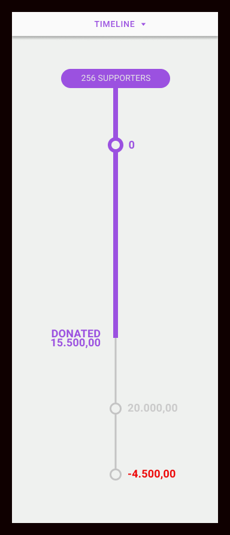

# 5.2. Events System

Our organization mobilizes people via various events.

* to obtain a financing for its activities - it organizes **Supporter events**
* to recruit a manpower it needs - it organizes **Volunteer events**
* to fulfill the children needs - it organizes **Sponsor events**.

Events are organized in different groups/types depending on their purpose.

> Events by type

| Event | Supporters | Volunteers | Sponsors |
| :--- | :--- | :--- | :--- |
| _Budget 2020_ | Yes |  |  |
| _Volunteers Wanted_ |  | Yes |  |
| _Hands-on \#34_ |  | Yes |  |
| _Hands-on \#35_ |  | Yes |  |
| _Sponsors Wanted_ |  |  | Yes |
| _Christmas Gift_ |  |  | Yes |
| _Birthday Present January_ |  |  | Yes |
| _Easter Gift_ |  |  | Yes |

Every event has a purpose, a goal. It targets items, money or labor/manpower. One event can have multiple targets.

> Events by purpose

| Event | Items | Money | Labor |  | Supporters | Volunteers | Sponsors |
| :--- | :--- | :--- | :--- | :--- | :--- | :--- | :--- |
| _Budget 2020_ |  | Yes |  |  | Yes |  |  |
| _Volunteers Wanted_ |  |  | Yes |  |  | Yes |  |
| _Hands-on \#34_ |  |  | Yes |  |  | Yes |  |
| _Hands-on \#35_ |  |  | Yes |  |  | Yes |  |
| _Sponsors Wanted_ | Yes | Yes |  |  |  |  | Yes |
| _Christmas Gift_ | Yes |  |  |  |  |  | Yes |
| _Birthday Presents for January_ | Yes |  |  |  |  |  | Yes |
| _Easter Gift_ | Yes |  |  |  |  |  | Yes |

Permanent events are active all year. One-time events are events with limited duration, active from few hours to several days.

> Events by frequency of activity

| Event | Permanent | One-time |  | Supporters | Volunteers | Sponsors |
| :--- | :--- | :--- | :--- | :--- | :--- | :--- |
| _Budget 2020_ | Yes |  |  | Yes |  |  |
| _Volunteers Wanted_ | Yes |  |  |  | Yes |  |
| _Hands-on \#34_ |  | Yes |  |  | Yes |  |
| _Hands-on \#35_ |  | Yes |  |  | Yes |  |
| _Sponsors Wanted_ | Yes |  |  |  |  | Yes |
| _Christmas Gift_ |  | Yes |  |  |  | Yes |
| _Birthday Presents for January_ |  | Yes |  |  |  | Yes |
| _Easter Gift_ |  | Yes |  |  |  | Yes |

Sponsors can select to fulfill one or more child's need.

> Events by quantity of needs

| Event | Single-need | Multiple-need |  | Supporters | Volunteers | Sponsors |
| :--- | :--- | :--- | :--- | :--- | :--- | :--- |
| _Sponsors Wanted_ | Yes | Yes |  |  |  | Yes |
| _Christmas Gift_ | Yes |  |  |  |  | Yes |
| _Birthday Presents for January_ | Yes |  |  |  |  | Yes |
| _Easter Gift_ | Yes |  |  |  |  | Yes |

Events that involve cash transactions. It can be one-time payment or reccuring payment on monthly basis. Supporters can make a one-time or recurring donation to our organization. Sponsors can make a one-time or recurring donation to the child.

> Events by payment frequency

| Event | One-time | Recurring |  | Supporters | Volunteers | Sponsors |
| :--- | :--- | :--- | :--- | :--- | :--- | :--- |
| _Budget 2020_ | Yes | Yes |  | Yes |  |  |
| _Sponsors Wanted_ | Yes | Yes |  |  |  | Yes |

## 5.2.1. Event Categories & Types

Events are grouped under 3 categories and each category a specific set of event types.

### Supporter Event Category

* **budget event type**

  Enables supporter's subscription to the reccuring financial payments to our organization, for instance _Budget 2020_ event. Sponsor can also make a one-time donation.

> Image of Supporter events



### Volunteer Event Category

* **recruitment event type**

  Enables the recruitment of volunteers with required set of skills. Individuals can register as a volunteers.

* **single-task event type**

  Enables the participation of volunteers in a **single hands-on task**, like _Building a House_, _Transporting Children_ event etc.

> Image of Volunteer events



### Sponsor Event Category

* **single-need event type**

  Enables sponsor's subscription to a **single need**, like the _Christmas Gift_, a _Birthday Present January_ or the _Easter Gift_ event. Sponsor fulfills single need of a child.

* **multi-need event type**

  Enables sponsor's subscription to **multiple needs**, like _Sponsors Wanted_ event. Sponsor fulfills one ore more needs of a child.

> Image of Sponsor events



## 5.2.2. Events Cards

Event card is an accordion and consists of card body, status element and timeline element.

### Card Body - Active State

A card body consists of a logo, title, subtitle, share button, image, a short description and buttons named registration and details.

> Image of card active state.



### Card Body - Completed State

An overlay which is shown after event completion. Displays thanks note and detailed summery about the event.

> Image of card completed state.



### Status Element

A visual representation of the event state. It is contextual, meaning that every type of event has its own representation.

> Image of card Status element.



### Timeline Element

A visual representation of the event progression. It is contextual, meaning that every type of event has its own representation.

> Image of card Timeline element.



