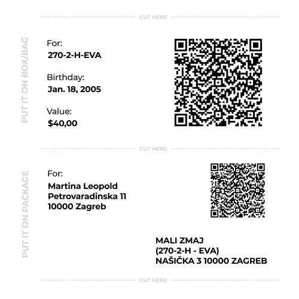

# 5.6. QR Code Generator and Scanner

This section summarizes the minimum QR Code Generator and Scanner requirements.

## Summary

Sponsors use QR code generated by QR Code Generator and Scanner for printing a labels during package shipping procedure.

Staff use QR Code Generator and Scanner for scanning the data and registering items into database.

## Code Data

The QR Code is generated from specific child's data for specific event and consists of:

* child\_id
* sponsor\_id
* event\_id
* content

## Package Label

> Printed label example.

